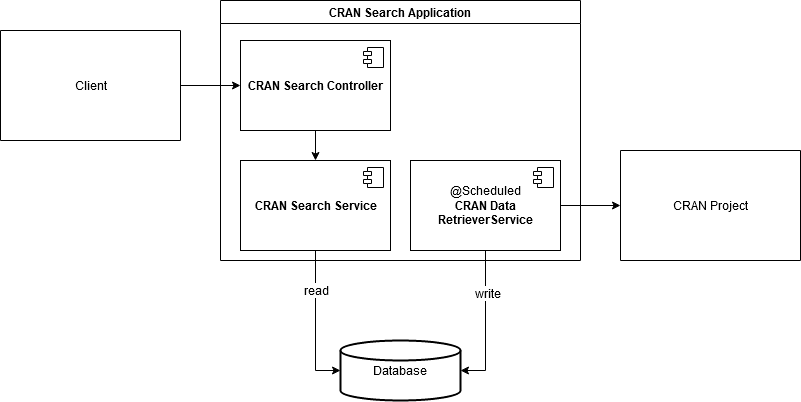

# CRAN Search
## Description
This is an application to read the list of packages from CRAN server, store their details in DB and expose a REST API endpoint to query for the packages

## Architecture


## Setup and Running
### Docker
#### Requirements
- Docker Engine - 19.03.5
- docker-compose - 1.25.4

For Mac and Windows, these should be setup automatically with [Docker Desktop](https://www.docker.com/products/docker-desktop)

For Linux, please follow the installation instructions [here](https://docs.docker.com/install/)  

#### Commands
Build and run
```shell script
docker-compose build
docker-compose up

# navigate to http://localhost:8080/ to view API
```
Stop and tear down
```shell script
docker-compose down
```
### Shell
#### Requirements
- OpenJDK 13
- MongoDB running locally

#### Commands
Build
```shell script
./mvnw install
```
Run
```shell script
./mvnw spring-boot:run
```

### Intellij IDEA
Open project and run CranSearchApplication
#### Debug
##### For Docker run
Setup Remote Debug in Configuration and run
##### For running directly from Intellij IDEA
Just run with debug mode instead of normal run mode